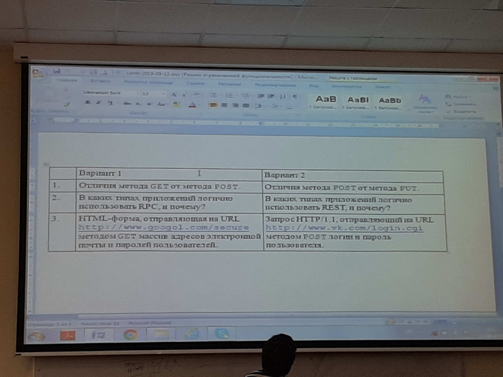

# \<s>ПИП\</s>

<pre>
Array
(
    [laba#1] => <a href="./l1">./lab1</a>,
    [laba#2] => <a href="./l2">./lab2</a>
)
</pre>
---

***[рубежка #1](./exams/first-test.md)***

* микроконтрольная #1

* микроконтрольная #2

* микроконтрольная #3

* микроконтрольная #4

---

***[lectures, presentations and info about labs](http://tlg.wtf/sPNPs)***