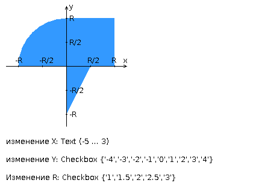

## _lab_ #1 - [here](http://p-n-p.herokuapp.com/l1/)
<table>
<tr><td></td><td>Разработать PHP-скрипт, определяющий попадание</td><td></td></tr>
<tr><td></td><td>точки на координатной плоскости в заданную область,</td><td></td></tr>
<tr><td></td><td>и создать HTML-страницу, которая формирует данные</td><td></td></tr>
<tr><td></td><td>для отправки их на обработку этому скрипту.</td><td></td></tr>
<tr><td></td><td>Параметр R и координаты точки должны передаваться</td><td></td></tr>
<tr><td></td><td>скрипту посредством HTTP-запроса. Скрипт должен</td><td></td></tr>
<tr><td></td><td>выполнять валидацию данных и возвращать HTML-страницу</td><td></td></tr>
<tr><td></td><td>с таблицей, содержащей полученные параметры и</td><td></td></tr>
<tr><td></td><td>результат вычислений - факт попадания или непопадания</td><td></td></tr>
<tr><td></td><td>точки в область. Кроме того, ответ должен</td><td></td></tr>
<tr><td></td><td>содержать данные о текущем времени и времени работы</td><td></td></tr>
<tr><td></td><td>скрипта.</td><td></td></tr>
<tr><td></td><td></td><td></td></tr>
<tr><td></td><td></td><td></td></tr>
<tr><td></td><td>Разработанная HTML-страница должна удовлетворять</td><td></td></tr>
<tr><td></td><td>следующим требованиям:</td><td></td></tr>
<tr><td></td><td>* Для расположения текстовых и графических элементов</td><td></td></tr>
<tr><td></td><td>необходимо использовать <strong><i><code>табличную верстку</code></i></strong>.</td><td></td></tr>
<tr><td></td><td>* Данные формы должны передаваться на обработку</td><td></td></tr> 
<tr><td></td><td>посредством GET-запроса.</td><td></td></tr>
<tr><td></td><td>* Таблицы стилей должны располагаться в отдельных</td><td></td></tr>
<tr><td></td><td>файлах.</td><td></td></tr>
<tr><td></td><td>* При работе с CSS должно быть продемонстрировано</td><td></td></tr>
<tr><td></td><td>использование селекторов атрибутов, селекторов</td><td></td></tr>
<tr><td></td><td>потомств, селекторов дочерних элементов, селекторов</td><td></td></tr>
<tr><td></td><td>элементов а также такие свойства стилей CSS, как</td><td></td></tr>
<tr><td></td><td>наследование и каскадирование.</td><td></td></tr>
<tr><td></td><td>* HTML-страница должна иметь "шапку", содержащую</td><td></td></tr>
<tr><td></td><td>ФИО студента, номер группы и новер варианта. При</td><td></td></tr>
<tr><td></td><td>оформлении шапки необходимо явным образом задать</td><td></td></tr>
<tr><td></td><td>шрифт (sans-serif), его цвет и размер в каскадной</td><td></td></tr>
<tr><td></td><td>таблице стилей.</td><td></td></tr>
<tr><td></td><td>* Отступы элементов ввода должны задаваться в процентах.</td><td></td></tr>
<tr><td></td><td>* Страница должна содержать сценарий на языке JavaScript,</td><td></td></tr>
<tr><td></td><td>осуществляющий валидацию значений, вводимых пользователем</td><td></td></tr>
<tr><td></td><td>в поля формы. Любые некорректные значения (например,</td><td></td></tr>
<tr><td></td><td>буквы в координатах точки или отрицательный радиус)</td><td></td></tr>
<tr><td></td><td>должны блокироваться.</td><td></td></tr>
</table>